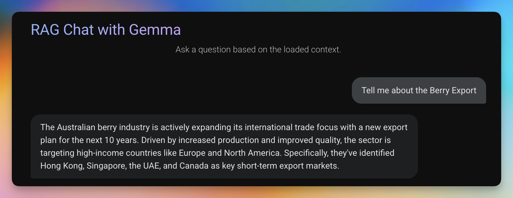

# Local RAG Chat App with Google Gemma 3, LangChain, and Reflex

A Retrieval-Augmented Generation (RAG) chatbot application built with Reflex, LangChain, and Ollama's Gemma model. This application allows users to ask questions and receive answers enhanced with context retrieved from a dataset.

This project contains code samples for the blog post [here](https://www.apideck.com/blog/building-a-local-rag-chat-app-with-reflex-langchain-huggingface-and-ollama).

## Blogs

1. [Understanding RAG](https://www.apideck.com/blog/understanding-rag-retrieval-augmented-generation-essentials-for-ai-projects)
2. [Building a Local RAG Chatbot with Ollama](https://www.apideck.com/blog/building-a-local-rag-chat-app-with-reflex-langchain-huggingface-and-ollama)


## Features

- 💬 Modern chat-like interface for asking questions
- 🔍 Retrieval-Augmented Generation for more accurate answers
- 🧠 Uses Gemma 3 4B-IT model via Ollama
- 📚 Built with the neural-bridge/rag-dataset-12000 dataset
- 🛠️ FAISS vector database for efficient similarity search
- 🔄 Full integration with LangChain for RAG pipeline
- 🌐 Built with Reflex for a reactive web interface

## Prerequisites

- Python 3.12+ 
- [Ollama](https://ollama.com/) installed and running
- The Gemma 3 4B model pulled in Ollama: `ollama pull gemma3:4b-it-qat`

## Installation

1. Clone the repository:
   ```bash
   git clone https://github.com/srbhr/Local-RAG-with-Ollama.git
   cd RAG_Blog
   ```

2. Install dependencies:
   ```bash
   pip install -r requirements.txt
   ```

3. Make sure Ollama is running and you've pulled the required model:
   ```bash
   ollama pull gemma3:4b-it-qat
   ```

## Usage

1. Start the Reflex development server:
   ```bash
   reflex run
   ```

2. Open your browser and go to `http://localhost:3000`


3. Start asking questions in the chat interface!

## Project Structure

```
RAG_Blog/
├── assets/                    # Static assets 
├── faiss_index_neural_bridge/ # FAISS vector database for the full dataset
│   ├── index.faiss            # FAISS index file
│   └── index.pkl              # Pickle file with metadata
├── faiss_index_subset/        # FAISS vector database for a subset of data
├── rag_gemma_reflex/          # Main application package
│   ├── __init__.py
│   ├── rag_gemma_reflex.py    # UI components and styling
│   ├── rag_logic.py           # Core RAG implementation
│   └── state.py               # Application state management
├── requirements.txt           # Project dependencies
└── rxconfig.py                # Reflex configuration
```

## How It Works



This application implements a RAG (Retrieval-Augmented Generation) architecture:

1. **Embedding and Indexing**: Documents from the neural-bridge/rag-dataset-12000 dataset are embedded using HuggingFace's all-MiniLM-L6-v2 model and stored in a FAISS vector database.

2. **Retrieval**: When a user asks a question, the application converts the question into an embedding and finds the most similar documents in the FAISS index.

3. **Generation**: The retrieved documents are sent to the Gemma 3 model (running via Ollama) along with the user's question to generate a contextualized response.

4. **UI**: The Reflex framework provides a reactive web interface for the chat application.

## Customization

You can customize the following aspects of the application:

- **LLM Model**: Change the `OLLAMA_MODEL` environment variable or modify the `DEFAULT_OLLAMA_MODEL` in `rag_logic.py`
- **Dataset**: Modify the `DATASET_NAME` in `rag_logic.py`
- **Embedding Model**: Change the `EMBEDDING_MODEL_NAME` in `rag_logic.py`
- **UI Styling**: Modify the styles in `rag_gemma_reflex.py`

## Environment Variables

- `OLLAMA_MODEL`: Override the default Gemma model
- `OLLAMA_HOST`: Specify a custom Ollama host (default: http://localhost:11434)

## License

This project is licensed under the MIT License. See the [LICENSE](LICENSE) file for details.

## Acknowledgements

- [Reflex](https://reflex.dev/) for the reactive web framework
- [LangChain](https://www.langchain.com/) for the RAG pipeline components
- [Ollama](https://ollama.com/) for local LLM hosting
- [HuggingFace](https://huggingface.co/) for embeddings and dataset hosting
